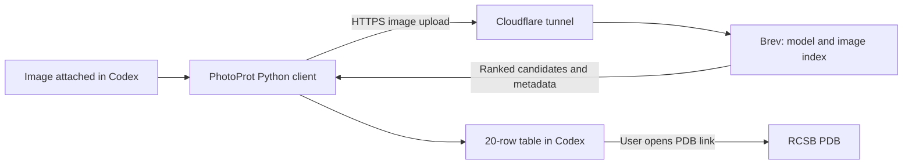

# PhotoProt for Codex

**A protein image becomes a ranked PDB table.**

Attach a protein cartoon or ribbon image to a local Codex task and ask PhotoProt to search it. The plugin sends that image to the PhotoProt service and returns 20 ranked PDB candidates with names, organisms, similarity scores and links to RCSB.

The current service searches **836,399 reference images across 38,833 PDB entries** (20 September 2026). No GPU, model download or Python packages are needed on your computer.

## Install

Requirements: Codex with plugin support, Git, Python 3.10+ (Codex desktop's bundled Python also works), and internet access to the PhotoProt service.

Run in your terminal:

```sh
codex plugin marketplace add CXFG01/photoprot-codex
codex plugin add photoprot@photoprot
```

Start a **new local Codex task** after installation. Attach or drag in a PNG, JPEG or WebP image, select PhotoProt's `protein-search` skill, and say:

> Search this protein image with PhotoProt.

You can also ask “Check whether the PhotoProt server is available” without sending an image. If your Codex version reports an unknown `plugin` command, update to a version with plugin support.

The attachment must provide a readable local file path. If your attachment surface exposes only a visual preview, provide the image's local path. This plugin uses Codex's attachment interface; it does not add a separate upload widget or integrate with web-only ChatGPT.

## Updating an existing installation

```sh
codex plugin marketplace upgrade photoprot
codex plugin add photoprot@photoprot
```

Start a new task afterwards so Codex reads the updated skill instructions.

## Network access in Codex

PhotoProt needs outbound HTTPS from Python. The skill checks server health before the first image upload in each task and requests network approval through Codex when required. A browser may reach the service while a restricted Codex command cannot resolve its hostname. A DNS error alone is not evidence that the service is offline.

Approve the network request if you want to use the service. If approved access still fails, compare `--health` using the same Python interpreter in your terminal and check local DNS/VPN/proxy settings. Certificate errors are reported separately; do not disable TLS verification. Failed image uploads are never silently retried.

## Result columns

| Column | Meaning |
|---|---|
| Rank | Position among the returned PDB candidates |
| PDB | Link to the deposited structure on RCSB |
| Protein / Organism | RCSB-derived metadata, when available |
| Similarity | Mean of the five best reference-view cosine similarities for that PDB |

The model searches the full available index for each image. Scores are **not probabilities, sequence identities or TM-scores**. The service always ranks candidates and currently has no calibrated “no credible match” detector. Similar-looking assemblies may be biologically unrelated; verify candidates using their RCSB records. The index covers a subset of the PDB archive.

## Public preview availability

The bundled API address is **https://api.photoprot.uk**; the website is [photoprot.uk](https://photoprot.uk). A named Cloudflare Tunnel connects it to the Brev GPU. Both inference and the tunnel restart automatically as system services. The hostname persists across tunnel restarts; availability still depends on the Brev instance running. Installing the plugin does not host the model or guarantee uptime.

The separate [reproducibility repository](https://github.com/CXFG01/photoprot-reproducibility) provides the checkpoint, full index, benchmark data and reproduction commands.

If the address changes, use an operator-provided PhotoProt HTTPS origin through `PHOTOPROT_URL` in the environment inherited by Codex, or explicitly ask the skill to use that origin. Client precedence is `--server`, then `PHOTOPROT_URL`, then the plugin's `settings.json`. Do not edit an installed cache as a permanent configuration method.

Images are limited to 10 MB; the service also limits decoded input to 20 megapixels. The client does not crop or alter the image, follow HTTP redirects, or automatically retry uploads. The current public service requires no API key.

## Data handling

The selected image passes from Codex through Cloudflare to the PhotoProt service on Brev. The client does not make another image copy or retain embeddings. Codex history, server result caches and operational/provider logs have separate retention boundaries. **This public preview has no audited confidentiality commitment.** Read [data handling](plugins/photoprot/PRIVACY.md) before uploading sensitive material.



## Development

This repository distributes the plugin client and skill. Model weights, training data, embeddings and server implementation are not included.

```sh
git clone https://github.com/CXFG01/photoprot-codex.git
cd photoprot-codex
python -m unittest discover -s plugins/photoprot/tests -v
python plugins/photoprot/scripts/search_protein.py --health
python plugins/photoprot/scripts/search_protein.py /absolute/path/protein.png
```

Tests use mocked HTTP responses and cover image validation, unchanged uploads, malformed responses, metadata failures, redirects, rate limits and safe table formatting. They do not require the live GPU service. See [client documentation](plugins/photoprot/README.md) for JSON output and alternate-server options.

Report reproducible issues through [GitHub Issues](https://github.com/CXFG01/photoprot-codex/issues). Include your Codex/Python versions and the error message; do not attach confidential images or credentials.

## Licence

The plugin code and documentation are [MIT licensed](LICENSE). This licence does not grant rights to third-party query images, PDB-derived metadata, model weights, or the hosted service.
